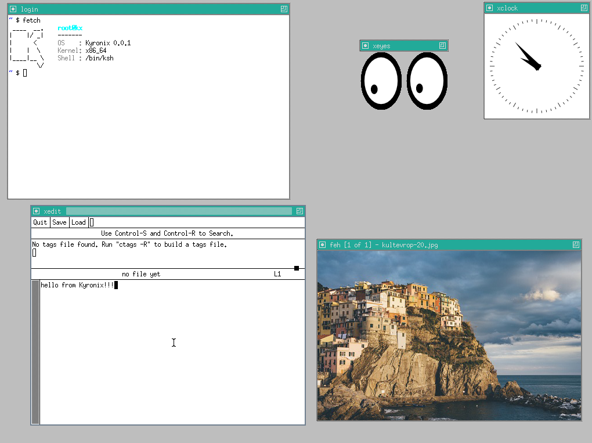

# Kyronix


Operating system that sucks less.


[](https://github.com/kyronix-project/kyronix/actions/workflows/test.yml)
[](#)
[](#)
[](#)

<br clear="left"/>

Kyronix is a modern hybrid operating system focused on
performance, security and stability.



## Features

### Kernel
- x86-64, 4-level paging, SMEP, NX-bit
- Limine bootloader (BIOS + UEFI)
- Preemptive scheduler (~1000 Hz)
- ELF64 loader (PIE + musl)
- 150+ Linux-compatible syscalls
- Loadable ELF64 kernel modules (`insmod`, `rmmod`, `lsmod`)
- Demand paging (`mmap`, `mprotect`, `mremap`, `brk`)
- RTC, CPUID, RDRAND

### Drivers
- Framebuffer console (PSF fonts)
- PS/2 keyboard & mouse
- PCI enumeration
- AHCI (SATA)
- virtio-net
- Serial console (COM1)
- evdev (`/dev/input/event*`)
- Virtual terminals
- UIO

### Filesystems
- POSIX VFS
- CPIO initramfs
- Ext2 (R/W)
- FAT32 (R/W)
- procfs, devfs
- eventfd, pipe, AF_UNIX sockets

### Networking ([LwIP](https://github.com/stm32duino/lwip))
- ARP, IPv4, ICMP, UDP, TCP
- DHCP client
- AF_INET socket API
- ping, wget, nc

### Userspace
- **ksh** shell
- **vi** text editor
- **kyrobox** POSIX utilities
- **login** authentication
- **pkg** package manager
- Runs musl-linked applications

### Advanced
- POSIX signals
- `clone()` threads
- Jails (FS/PID/IPC isolation)
- Shared memory
- futex
- epoll, poll, select
- Continuous integration test suite

### Security hooks

`PHANTOM_FORKING` records suspicious faults, VFS access and network activity.
Trap mode can create a COW sandbox with an isolated synthetic VFS, dummy crypto
material, sanitized descriptors and simulated network replies.

Quarantine mode parks the source process. User write/NX faults are queued to a
kernel worker, which builds the sandbox and resumes the exact faulting
instruction there. Sandbox setup is atomic and fails closed.

This is an experimental mechanism: the queue is bounded, unsupported faults use
the normal signal/panic path, and fault-quarantined sources cannot be safely
resumed.

`Anti-TOCTOU jitter` correlates rapid cross-thread VFS and futex/memory access,
then delays the flagged thread's next wake-up by 25–250 µs.

## Build

### Dependencies

```sh
gcc musl-tools qemu-system xorriso cpio dosfstools mtools e2fsprogs
libncurses-dev curl file
```

### Quick start

```sh
make iso
make run
```

`make run` boots the live system and attaches a persistent 512 MiB disk. Log
in as `root`/`root` and run `installer`. After installation, boot that disk
directly with:

```sh
make boot
```

The installed system is stored in `dist/kyronix-disk.img`. `make clean` keeps
this file.

### Make targets

| Target | Description |
|---------|-------------|
| `make` / `make iso` | Build `dist/kyronix.iso` |
| `make run` | Build and boot the ISO with the persistent disk |
| `make boot` | Boot the installed disk without the ISO |
| `make test` | Build and run all tests in QEMU |
| `make clean` | Remove build output, preserving the installed disk |

To build in a container, append `CRUNTIME=podman` or `CRUNTIME=docker`.

## Project structure

| Directory | Purpose |
|-----------|---------|
| `kernel/` | Kernel source |
| `user/` | Userspace |
| `rootfs/` | Initramfs |
| `limine/` | Bootloader |
| `meta/` | Assets & screenshots |

## Support

If you like Kyronix, consider supporting its development.

<a href="https://buymeacoffee.com/kyron1x">
  
</a>

## License

Distributed under the ISC License. See `LICENSE` for more information.
